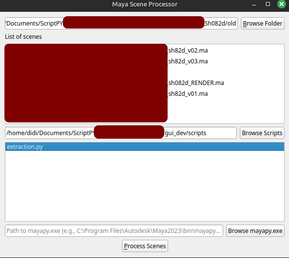

# Maya Scene Processor



A PyQt5-based GUI tool for batch processing Maya scene files with custom Python scripts.

## Features

- **Batch Processing**: Execute scripts on multiple Maya scenes (`.ma`/`.mb`) at once
- **Script Management**: Load and select multiple Python scripts
- **Flexible Execution**: Run scripts through `mayapy.exe` for Maya environment
- **Detailed Reporting**: View processing results directly in the UI
- **Cross-Platform**: Works on Windows, macOS, and Linux (with mayapy path configured)

## Installation

### Prerequisites

- Python 3.6+
- PyQt5 (`pip install PyQt5`)
- Maya installation (for mayapy)

### Setup

1. Clone/download the repository
2. Install dependencies:
   ```bash
   pip install PyQt5
   ```

### Run the application

```bash
cd maya_scene_processor
python maya_open.py
```

## Interface Overview

### Scene Browser

- **Browse** for folder containing Maya scenes
- Automatically detects `.ma` and `.mb` files
- Displays found scenes with shortened paths

### Script Browser

- Set directory containing processing scripts
- **Multi-select** Python scripts to execute
- Only shows `.py` files (ignores files starting with `_`)

### MayaPy Configuration

- Specify path to `mayapy.exe`
- Auto-detects common installation paths:
  - Windows: `C:\Program Files\Autodesk\Maya2023\bin\mayapy.exe`
  - Mac: `/Applications/Autodesk/maya2023/Maya.app/Contents/bin/mayapy`

### Processing

- Click **"Process Scenes"** to execute selected scripts
- View results in the output panel
